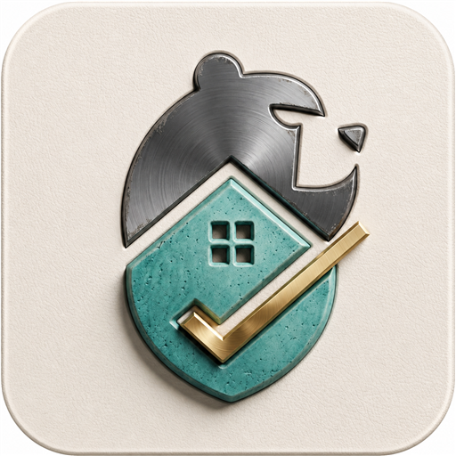
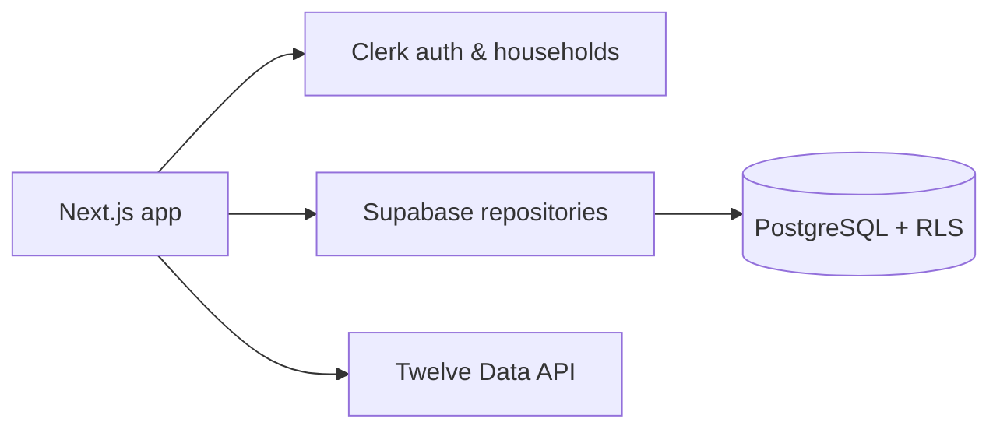

<div align="center">
  

  # BearVault

  **A calm, shared home for your household finances.**

  Track spending, plan budgets, understand cash flow, monitor investments, and work toward goals—all in one secure workspace.

  [](https://nextjs.org/)
  [](https://react.dev/)
  [](https://www.typescriptlang.org/)
  [](https://supabase.com/)
  [](https://vercel.com/)
</div>

---

## The household picture, clearly organized

BearVault brings everyday money management and long-term planning into a single responsive application. Clerk Organizations define the household, Supabase keeps financial records isolated with row-level security, and Twelve Data supplies current and historical market information.

| Understand today | Plan ahead | Share securely |
| --- | --- | --- |
| Dashboard, accounts, transactions, and cash flow | Monthly budgets, investments, and savings goals | Household membership, protected records, and role-aware access |

### Highlights

- 📊 A responsive dashboard for net worth, spending, and recent activity
- 💳 Unified accounts and transaction tracking
- 🧾 Category-level monthly budgeting and purchase entry
- 📈 Investment holdings, lots, and market-data views
- 🎯 Savings goals with clear progress
- 👥 Shared household access through Clerk Organizations
- 🌗 System, light, and dark appearance modes
- 📱 Mobile navigation and installable PWA support
- 🧪 A public demo backed by clearly synthetic data

## How it fits together



The public demo stays separate from authenticated household data. Production records flow through typed repositories and are restricted to the active household by database policies.

## Technology

| Layer | Tools |
| --- | --- |
| Application | Next.js App Router, React, TypeScript |
| Interface | CSS Modules, Mantine, Tabler Icons, Recharts |
| Identity | Clerk authentication and Organizations |
| Data | Supabase PostgreSQL and row-level security |
| Markets | Twelve Data |
| Delivery | Vercel and PWA support |

## Run locally

```bash
git clone https://github.com/sampbaer-creator/BaerVault.git
cd BaerVault
npm install
npm run dev
```

Open [http://localhost:3000](http://localhost:3000). The landing page and public demo work without an account. Protected household features require Clerk, Supabase, and Twelve Data credentials in `.env.local`.

> [!IMPORTANT]
> Keep credentials in `.env.local` and never commit secret values.

### Development commands

```bash
npm run dev      # Start the development server
npm run lint     # Check code quality
npm run build    # Create a production build
```

## Project map

```text
app/          Routes, layouts, API handlers, and global styles
components/   Shared UI, navigation, branding, and preferences
features/     Finance workspaces and scoped styles
lib/          Data access, domain helpers, and demo data
supabase/     Database migrations and security policies
docs/         Architecture and project documentation
```

For a deeper tour, read the [architecture guide](docs/ARCHITECTURE.md) and [project map](docs/PROJECT_MAP.md).

## Project status

BearVault is under active development. Core household-finance workflows are available today. Direct bank connections, payments, email, and analytics are not yet integrated.

---

<div align="center">
  Built with care by <a href="https://github.com/sampbaer-creator">Samuel Baer</a>.
</div>
